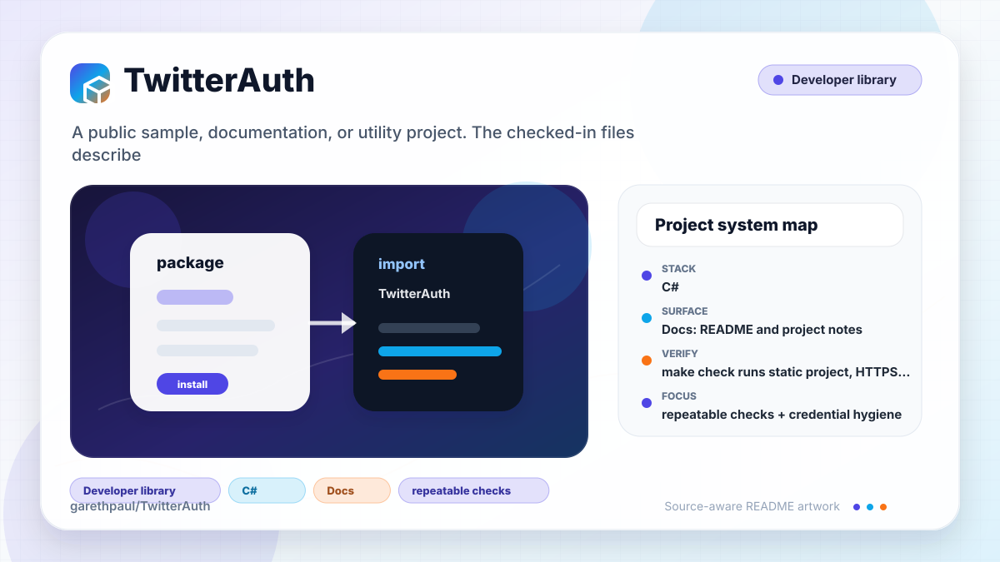

# TwitterAuth

<!-- README-OVERVIEW-IMAGE -->


## Overview

`garethpaul/TwitterAuth` is a public sample, documentation, or utility project. The checked-in files describe a public sample, documentation, or utility project with the structure summarized below.

This README is based on the checked-in source, manifests, scripts, and repository metadata on the `master` branch. The project language mix found during review was: C# (2).

## Repository Contents

- `README.md` - project overview and local usage notes
- `.github/workflows/check.yml` - GitHub Actions baseline for `make check`
- `docs` - source or example code
- `SECURITY.md` - security reporting and disclosure guidance
- `UnityTwitter` - source or example code
- `VISION.md` - project direction and maintenance guardrails

Additional scan context:

- Source directories: UnityTwitter, docs
- Dependency and build manifests: none detected
- Entry points or build surfaces: none detected
- Test-looking files: no obvious test files detected

## Getting Started

### Prerequisites

- Git
- A compatible legacy Unity editor. The repository does not contain
  `ProjectVersion.txt`, so no exact Unity release is claimed.

### Legacy Unity And API Boundary

- Open the checked-in `UnityTwitter` project and inspect the `Demo` scene.
- Historically, the consumer key and consumer secret were entered locally on
  the Demo object in the Unity Inspector. Never commit those values.
- Access tokens remain session-only, so restarting the demo requires a new
  authorization flow.
- The sample uses PIN-based OAuth, explicit user-triggered status posting,
  Unity's legacy `WWW` transport, and checked-in HTTPS Twitter endpoints.
- OAuth timestamp values use invariant-culture Unix-second formatting so
  request signatures do not vary with the host locale.
- Twitter app registration, PIN authorization, API access, posting, and Unity
  runtime behavior are retired or unverified. Static contracts do not prove
  that the historical service flow still works.

### Setup

```bash
git clone https://github.com/garethpaul/TwitterAuth.git
cd TwitterAuth
```

The setup commands above are derived from repository files. Legacy mobile, Python, or JavaScript samples may require older SDKs or package versions than a modern workstation uses by default.

## Running or Using the Project

- Open `UnityTwitter` with a compatible legacy Unity editor and inspect the demo scene.
- OAuth access tokens are kept only for the active demo session. Startup
  removes values written to `PlayerPrefs` by older revisions, so users must
  authenticate again after restarting the app.
- OAuth signing and browser authorization reject null, empty, whitespace-only,
  and surrounding-whitespace credentials, request tokens, PINs, and
  access-token fields through the existing redacted failure callbacks.
- Public OAuth and posting coroutines reject missing callbacks before
  credentials, signing, or network work.
- Tweet text rejects null, empty, whitespace-only, and over-limit values before
  OAuth signing or network construction while preserving valid text exactly.
- OAuth response parsing requires each consumed token or identity field to
  occur exactly once; missing or duplicated fields fail through the same
  redacted callbacks. Malformed percent escapes, invalid UTF-8, and decoded
  control characters also fail closed.
- OAuth callback generations ignore superseded request/access token results,
  clear replacement state, consume request tokens before exchange, and are
  invalidated when the demo component is disabled.
- OAuth timestamps truncate to elapsed Unix seconds, and signature parameters
  are percent-encoded before ordinal key/value sorting.
- Run `make check` for static checks. The build step runs Unity only on hosts
  where `unity` is installed.

## Testing and Verification

- `make check` runs static project, HTTPS endpoint, authorization URL
  token-safety, token-log redaction, OAuth nonce entropy, access-token exchange
  input guard, API-level consumer credential guard, account-identifier log
  redaction, tweet-text validation log redaction, provider-error log redaction,
  exact-key and unique OAuth response parsing, strict form decoding,
  timestamp/signature normalization, session-only OAuth storage, callback
  preflight and lifecycle mutations, OAuth-flow guard, and completed-plan
  checks.
- GitHub Actions runs the same `make check` static baseline on pushes and pull
  requests using Ubuntu 24.04, read-only permissions, immutable action pins,
  disabled checkout credential persistence, and cancellation for superseded
  runs. Unity editor execution remains optional and host-dependent.
- Completed maintenance plans live under `docs/plans` and are checked by
  `make check`.
- Legacy Unity editor validation for scene/runtime behavior

When the required SDK or runtime is unavailable, use static checks and source review first, then verify on a machine that has the matching platform toolchain.

## Configuration and Secrets

- Detected references to Twitter. Keep API keys, OAuth credentials, tokens, and account-specific values in local configuration only.

## Security and Privacy Notes

- Review changes touching authentication or token handling; examples from the scan include UnityTwitter/Assets/Demo.cs, UnityTwitter/Assets/Twitter.cs, UnityTwitter/Assets/readme.txt.
- Review changes touching external API calls or credential-adjacent configuration; examples from the scan include UnityTwitter/Assets/Demo.cs, UnityTwitter/Assets/Twitter.cs, UnityTwitter/Assets/readme.txt, docs/bugs/p2-plain-http-runtime-endpoint-af8489704cbb4afe.md.
- Review changes touching network requests, sockets, or service endpoints; examples from the scan include UnityTwitter/Assets/Demo.cs, UnityTwitter/Assets/Twitter.cs, UnityTwitter/Assets/readme.txt, docs/bugs/p2-plain-http-runtime-endpoint-af8489704cbb4afe.md.
- Review changes touching file, media, JSON, XML, CSV, OCR, or data parsing; examples from the scan include UnityTwitter/Assets/Twitter.cs.

## Maintenance Notes

- See `SECURITY.md` for vulnerability reporting and safe research guidance.
- See `VISION.md` for project direction and contribution guardrails.
- See `docs/plans/2026-06-08-twitterauth-baseline.md` for the current static
  verification baseline.
- See `docs/plans/2026-06-08-twitterauth-pin-guard.md` for the request-token
  guard on PIN submission.
- See `docs/plans/2026-06-08-twitterauth-post-token-guard.md` for the
  access-token guard on tweet submission.
- See `docs/plans/2026-06-09-oauth-response-log-redaction.md` for API-level
  OAuth response-body log redaction.
- See `docs/plans/2026-06-09-oauth-nonce-entropy.md` for cryptographic OAuth
  nonce generation coverage.
- See `docs/plans/2026-06-09-authorization-url-token-guard.md` for the
  authorization-page request-token guard and URL encoding coverage.
- See `docs/plans/2026-06-09-access-token-input-guard.md` for the
  access-token exchange request-token and PIN guard coverage.
- See `docs/plans/2026-06-09-consumer-credential-guards.md` for API-level
  consumer credential guard coverage.
- See `docs/plans/2026-06-09-account-identifier-log-redaction.md` for
  successful OAuth user ID and screen-name log redaction coverage.
- See `docs/plans/2026-06-09-tweet-text-log-redaction.md` for tweet body
  validation log redaction coverage.
- See `docs/plans/2026-06-10-ci-baseline.md` for the lightweight GitHub
  Actions baseline.
- See `docs/plans/2026-06-10-session-only-oauth-tokens.md` for the completed
  removal of plaintext OAuth credential persistence.
- See `docs/plans/2026-06-10-provider-error-log-redaction.md` for transport and
  API response error log redaction coverage.
- See `docs/plans/2026-06-12-oauth-response-field-parsing.md` for exact-key,
  decoded, fail-closed OAuth response parsing.
- See `docs/plans/2026-06-13-oauth-whitespace-input-guards.md` for OAuth input
  whitespace rejection before side effects.
- See `docs/plans/2026-06-13-oauth-response-field-uniqueness.md` for
  fail-closed duplicate OAuth response fields.
- See `docs/plans/2026-06-13-stale-oauth-callback-guards.md` for auth attempt
  generations and one-time request-token consumption.
- See `docs/plans/2026-06-14-legacy-unity-setup-notes.md` for the historical
  Unity, credential, OAuth, transport, and retired Twitter API boundary.
- See `docs/plans/2026-06-16-invariant-oauth-timestamp.md` for the
  locale-independent OAuth timestamp signing boundary.
- See `docs/plans/2026-06-16-whitespace-tweet-preflight.md` for the completed
  tweet text preflight and valid-content preservation boundary.
- See `docs/plans/2026-06-17-oauth-callback-preflight.md` for public coroutine
  callback preflight ordering and mutation coverage.

## Contributing

Keep changes small and tied to the project that is already present in this repository. For code changes, document the toolchain used, avoid committing generated dependency directories or local configuration, and update this README when setup or verification steps change.
